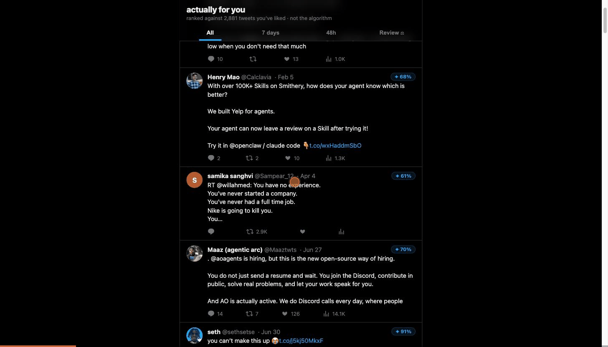
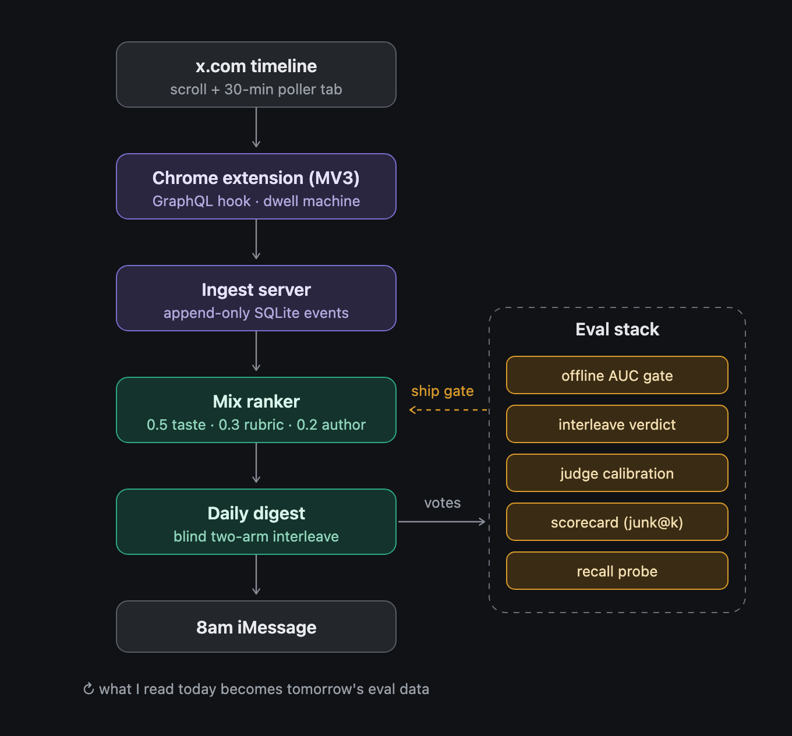

# actually-for-you

**A single-user re-ranker for the X (Twitter) timeline.** A Chrome extension captures how I
actually read — dwell, opens, likes, bookmarks — and a local pipeline re-ranks my feed by that
revealed taste. It texts me a digest at 8am; every digest secretly A/Bs two rankers; my hand
votes grade everything. One user, no cloud, no API keys, zero server dependencies — nothing
leaves my machine.



_Every card: a **✦ score** (taste + LLM rubric + author prior) and 👍/👎 votes that become the
eval's gold labels. Two rankers are secretly interleaved in every slate._

## Why

X ranks for time-on-site. I want the feed ranked by what I actually read thoughtfully — with a
permanent `explore` lane so it never collapses into a filter bubble.

## Architecture



**Sensor** (`extension/`) — built around how X fights capture:
- Content (GraphQL hook) and behavior (dwell machine) in **independent failure boundaries**;
  `capture_health` events make breakage loud.
- GraphQL matched by **operation name** (IDs rotate) · selectors on **`data-testid`** (classes
  churn) · dwell keyed by **`tweet_id`** (X recycles DOM nodes).
- Engagements read from **button-state flips**, not clicks — keyboard shortcuts count.
- Long-form tweets read from **`note_tweet`**, not the truncated preview; author verification,
  bio, and follower counts captured for the reader's hover card — **UI-only, never a ranking
  feature**.
- Durable state in **IndexedDB** (MV3 workers die constantly).
- A 30-min **poller tab** feeds candidates through the same path — never behavioral labels.

**Pipeline** (`ingest/`) — Node + built-in `node:sqlite`, zero deps, token-authed writes.
Events are append-only; labels re-derive from raw. Every serve logs its rank, lane, and
drafting arm; votes and opens flow back. Today's reading is tomorrow's eval data. X mints
several tweet_ids for one posting event, so candidates dedup on **(author, text)** content
twins — thumbing one copy down retires its clones too.

## Ranking signals

Every tweet is scored by three signals, blended with fixed hand-set weights — no learned
weights, every knob legible:

`score = 0.5·taste + 0.3·rubric + 0.2·author` (each z-scored, winsorized at ±2)

- **Taste (0.5)** — how similar the tweet's text is to the ~2,900 tweets I've liked (TF-IDF
  cosine). Length-normalized, so a tweet can't buy score by being long.
- **Rubric (0.3)** — an LLM reads the tweet and grades it 0–10 against `RUBRIC.md`, a short
  written description of what I want more of. It sees only the text — no author, no like
  counts — so "high quality" can't quietly become "already famous". Runs on the local `claude`
  CLI; if scoring fails, tweets rank neutral instead of blocking the digest.
- **Author prior (0.2)** — how often I've actually engaged with this author before. Computed
  from behavior only, never from my votes — those are reserved for grading rankers (below).

Two adjustments after the blend:

- **Explore lane** — ~10% of every digest is tweets the ranker did *not* choose, so the feed
  never becomes an echo of itself. My votes on these cards double as a blind-spot audit: labels
  on exactly the cards the ranker rejected (not an unbiased sample — but the one read the
  ranker can't flatter).
- **Diversity pass (MMR)** — near-duplicate takes get penalized, so the top of the digest
  isn't five versions of the same story.

Tweet length, media, and thread-ness are treated as **confounders**: regressed out during any
training, never used as reward. A tweet can't earn rank for being long or having a picture.

That fixed-weight blend is the incumbent, `mix`. It now has a **learned challenger**:
`review-lr`, a logistic regression over a sentence embedding plus the same three signals,
trained on my own votes — but only the ones that can never judge it again (the story below).

## How it grades itself

Three layers, ground truth up: my hand votes are the only ground truth, an **offline gate**
screens rankers, and a **live A/B test** inside the daily digest picks winners. One rule holds
everywhere: keyword scores and LLM scores may *rank* tweets, but only my 👍/👎 votes may
*judge* rankers — anything else would be a model grading its own homework.

**The offline gate** (`npm run eval`) asks one question: take every pair of tweets where I
voted 👍 on one and 👎 on the other — how often does the ranker put the 👍 tweet higher? That
fraction is the AUC below: 0.5 is a coin flip, 1.0 is perfect. A ranker passes only if it
beats the **strongest** dumb baseline by a margin the bootstrap confidence interval says is
real; an interval containing zero is a tie, not a win.

The gate is also **prospective**. Every vote cast up to 2026-07-14 is a *development* pool:
I changed the metric, the credit formula, and the baseline policy while looking at those
votes, so no confidence interval on them accounts for my own choices. They print as an
advisory regression read; only votes cast after the freeze can ever say SHIP.

For weeks the honest reading was bleak: on the dev pool `mix` was statistically **tied** with
`char_len` — sheer tweet length — and every learned model I tried was worse. Embeddings
trained on my *engagement* read the gate at 0.43–0.45, below chance: on an already-ranked
surface, dwell isn't taste. The fix wasn't a bigger model, it was better labels. The ~940
pre-freeze votes were already **spent** as dev currency — I designed the metric while looking
at them, so they can never verdict again — which makes them free to *train* on. `review-lr`
trains on exactly those spent votes and is judged only on votes it has never seen:

```
▼ REVIEW-PROSPECTIVE (votes since the freeze) — NON-CIRCULAR SHIP GATE  (128 👍 × 132 👎)
model                            AUC  Δ vs base CI
char_len (strongest baseline) 0.7243
mix (M9 digest blend)         0.7554  [-0.016, +0.081]
rubric (LLM judge)            0.7718  [-0.010, +0.108]
review-lr (dev-trained)       0.7873  [+0.016, +0.114] *

SHIP ✅ — beats the strongest baseline on post-freeze votes, CI excludes zero.
```

The first SHIP the gate has ever printed — and the margin *widened* as votes accumulated
(the CI's lower bound went 0.006 → 0.016 from n=213 to n=260), which is what a real effect
does and a lucky artifact doesn't.

**The live A/B** (`npm run interleave`) is the deciding vote. Every morning's digest is
secretly drafted by two rankers taking turns, like picking teams — the UI is identical either
way, and nothing reveals which ranker picked which card. A ranker earns credit when I open or
👍 its picks, and loses credit when I 👎 them.

The first three weeks were a **pilot** — the credit formula changed mid-flight, so its numbers
tune the instrument, they don't rank the rankers. Final pilot read: TIED at n=83 judged events
(keyword − mix CI [-0.096, 0.156]). The confirmatory window opens 2026-07-16, re-frozen the
day `review-lr` cleared the offline gate and took the challenger slot — **mix vs review-lr**,
credit formula and floor unchanged, recorded before a single in-window serve. One rule against
fooling myself: the CI prints **once**, at a predeclared 2-day horizon. The fast horizon is a
declared trade — at that n the CI only separates large effects, so TIED means "no big effect",
and a follow-up window must be predeclared fresh, never grown from a lean. No peeking, no "run
until it's significant".

Three smaller instruments run alongside:

- **Judge calibration** — every edit to `RUBRIC.md` is scored on whether the LLM's grades
  moved closer to my votes (0.688 → 0.721 after personalizing it, now at full coverage).
  Observe-only: tuning the rubric against this table would make the judge grade itself.
- **Scorecard** — junk among the *judged* top-10 cards each day, with vote coverage printed
  beside it (37.9% of 58 judged so far, single-digit on recent days). An earlier version
  divided by all serves, so a day I didn't vote read as 0% junk — quality "improving" because
  I stopped grading. Now a no-vote day reads "no votes", never 0%.
- **Recall probe** — tweets I organically liked that the digest never showed me first: the
  detector for what the system *misses*, not just what it mis-ranks.

## Field notes

- A malformed diagnostic event rolled back the data it monitored — found by logging the
  swallowed exception, not reading code.
- Leaked dwell timers showed up as *identical* values across distinct tweets. Per-interval cap.
- X moved a field; the test fixture had the old shape. Green tests, empty handles. A green test
  on a stale fixture is worse than none.
- The `claude` CLI ignores SIGTERM during backoff — timeouts minted 14-min zombies. Hard
  deadline + SIGKILL; coverage now prints beside every verdict.
- The first gate rightly killed my learned model (after its own bugs: a "random" baseline
  scoring 1.0 off snowflake IDs, an 86%-positive pool). Later the gate itself went suspect —
  it was discarding votes and crediting keyword on un-orderable pairs. The pairwise rebuild
  separated the arms on the same votes.
- The A/B keyed opens to a tweet's *first* drafting arm but votes to its *latest* — a
  cross-arm re-serve could put an arm's numerator on one ranker and its denominator on
  another. First-serve keying everywhere now; caught by an external review before it bit.
- ~800 votes accumulated while I changed the metric, the credit formula, and the baseline
  policy. "Never trained on" is not "never looked at" — those votes are a dev set now, and
  the verdict waits for votes cast after the freeze.
- Engagement-trained embeddings scored 0.43–0.45 — *below* chance. The same embeddings cleared
  the gate the day they were retrained on hand votes. The model was never the bottleneck; the
  labels were. (And the spent dev votes were the only non-circular place to get them.)

## Deliberately out of scope

**Multi-user/cloud** (one person's private surface) · **general recommender** (candidates only
from my own timeline) · **bigger models** (the one that finally cleared the gate is a logistic
regression — the bottleneck was labels, not parameters).

## Stack

| Layer | Choice | Why |
|---|---|---|
| Extension | esbuild + MV3, TypeScript | 4-line build; WXT removed once it earned nothing |
| Ingest | Node + `node:sqlite` | **zero runtime deps** |
| Ranking | Pure TypeScript (`mix`) + a `uv` Python sidecar (`review-lr`: MiniLM + sklearn LR) | sidecar failure degrades to neutral, never blocks |
| LLM judge | local `claude` CLI | no API key; degrades to neutral |
| Evals | prospective AUC gate + fixed-horizon A/B | offline guardrail, online verdict; seeded, reproducible |
| Tests | vitest + `node:test` | 45 + 123 green |
| Scheduling | macOS launchd | survives reboot |

## Running it

```sh
cd ingest && echo "AFY_TOKEN=$(openssl rand -hex 16)" > .env.local && npm start   # Node ≥22; reader at :2727
cd extension && ./build.sh    # bakes the token; chrome://extensions → Load unpacked → dist/
npm test                      # either package · npm run eval = the ship gate
```

8am delivery is a launchd plist running `npm run daily`. `CLAUDE_BIN` and `UV_BIN` in
`.env.local` point at the `claude` and `uv` binaries (both optional — the LLM judge and the
`review-lr` sidecar each degrade to neutral without them).

## History

Fifteen milestones: capture → ingest → read loop → labels → the learned-ranker HOLD → daily
delivery → poller → LLM rubric → mix → serve telemetry → interleaving → the eval rebuild →
the prospective freeze → the first SHIP (`review-lr`, trained on spent dev votes) and its
live window vs `mix`. ~72k tweets, ~100k impressions, ~1,200 hand votes.
[`PROGRESS.md`](./PROGRESS.md) · [`PRD.md`](./PRD.md) · [the blog post](./docs/blog-post.md).

## Inspirations

[noscroll](https://x.com/noscroll) and [backscroll](https://sdan.io/projects/backscroll) — the
two projects that seeded the idea of taking your own feed back.
