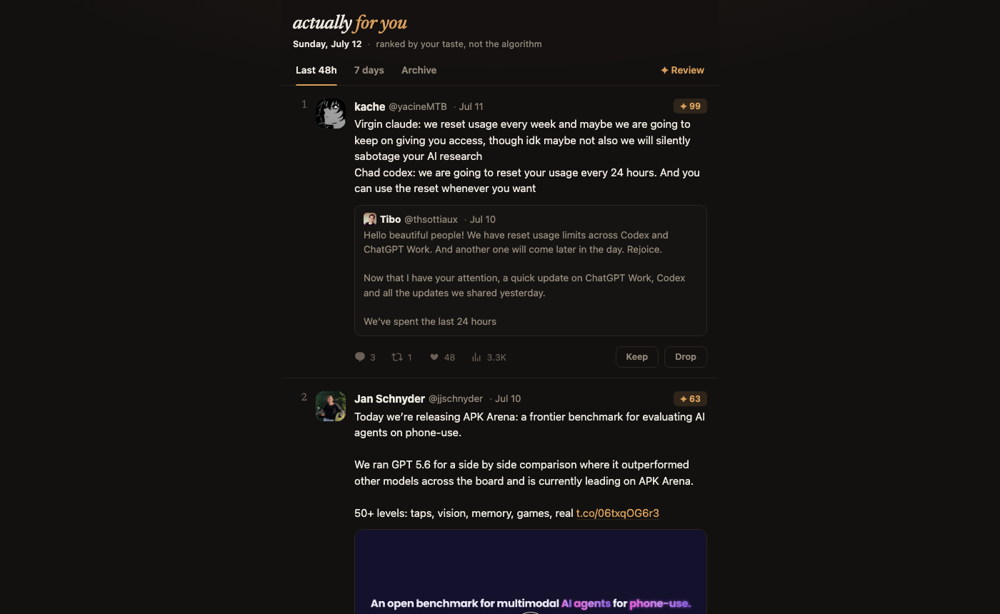
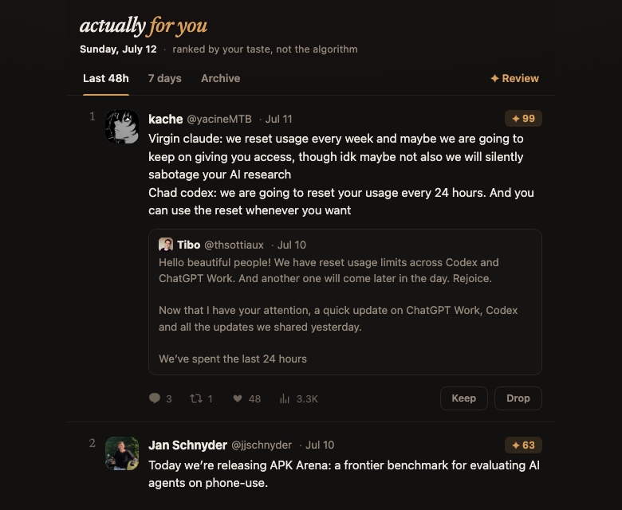

# I rebuilt my X feed for an audience of one — and the hard part was the eval

I got tired of my X feed. Not in the vague "social media is bad" way — in the specific way where
I could feel the algorithm optimizing for *its* goals (keep me scrolling, show me the ragebait
that performs) instead of mine (the long technical threads I actually read to the end and save).
So I did the obvious over-engineer's move: I rebuilt the ranking algorithm for an audience of
one. Me.

The project is called **actually-for-you**. A Chrome extension quietly watches how I read my
feed — how long I dwell on each tweet, which ones I open, like, bookmark — and a local pipeline
re-ranks the same tweets by my *revealed* taste. Every morning at 8am it texts me a digest.
Every digest secretly runs a blind A/B between two rankers. Single-user by design: no accounts,
no cloud, nothing leaves my laptop.



The ranker turned out to be the easy part. The story worth telling is the eval stack — the gate
that told me not to ship my first model, and the later, stranger discovery that the gate itself
had become the wrong instrument. Both below.

## Capturing a hostile surface

First you have to see what you read, and X does not want you to. Dwell time, detail-opens,
profile-expands — none of these exist in any scrape of a timeline. They're first-party telemetry
X collects and doesn't expose. You have to sense them at the moment they happen, off a page that
was never built to be observed. A few things I learned the hard way:

- **Match GraphQL operations by name, not by ID.** X's timeline comes over GraphQL, and the
  numeric query IDs rotate. Anchor on the operation *name* or your capture silently dies on the
  next deploy.
- **Anchor DOM selectors on `data-testid`, never CSS classes.** The classes are obfuscated and
  churn constantly. `data-testid` is the stable contract.
- **Accumulate dwell by tweet ID, never by DOM node.** The timeline virtualizes — it recycles a
  small pool of DOM nodes as you scroll — so if you track reading time per element, you smear
  one tweet's attention onto whatever recycles into its slot.
- **The MV3 service worker is ephemeral.** It gets killed constantly, so no durable state can
  live there. Everything goes through an IndexedDB queue that drains on a natural session
  boundary.
- **Watch state, not input.** Logging likes on the *click event* misses every keyboard shortcut
  and counts cancelled menus. Watching the button's `data-testid` flip (`like` → `unlike`) is
  input-agnostic and confirms the action actually happened.

I split content capture (the GraphQL hook) and behavior capture (the DOM observer) into
independent failure boundaries — a rule that paid off in a way I'll come back to. And once
capture was trustworthy, an ephemeral background tab started polling my own home timeline every
30 minutes through the *same* capture path: perfect first-party traffic, no API replay, nothing
to rot when X rotates its internals. Polled tweets are candidates only — they can never mint
behavioral labels, because nobody actually read them.

## The bug I found by tracing, not staring

At some point capture just… stopped. The database count froze. My first instinct was to read
the code and guess. That's almost always the slow path.

Instead I added freshness telemetry — "how long since the last impression?" — and a log line on
the ingest path. That immediately told me something a code-read wouldn't have: the browser *was*
reaching the server, sending the same batch every 15 seconds, and the server was failing to
write it while the extension retried forever. So I logged the exception the server was
swallowing.

The culprit: a diagnostic event (`capture_health`, the thing that's supposed to make breakage
*loud*) had a malformed field that couldn't bind to SQLite. It threw *inside the write
transaction*, which rolled back the real data along with it. A diagnostic stream was taking down
the payload it existed to observe — the exact failure my "independent boundaries" rule was meant
to prevent, sitting one layer below where I'd drawn the boundary.

Lesson I keep relearning: **when something's broken, add the instrument that makes the invisible
state visible, then look. Don't guess from the code.** That habit ends up being the spine of
this whole story.

## Act one: the eval that said no

I built a learned ranker — logistic regression over a hashing-trick bag-of-words, plus author
features. Nothing fancy; the point was never a big model. And I built an offline replay harness
as the **ship gate**: the learned model only replaces the simple baseline if it beats that
baseline on held-out data.

The first run said **SHIP ✅**. It was lying, and finding out *why* was the whole education:

**The random baseline scored a perfect 1.0.** That's impossible unless something's leaking the
answer. It was: tweet IDs are time-ordered snowflakes, and my positive examples (older,
harvested from my likes) and negatives (recent timeline) lived in different ID ranges. So *any*
function of the ID — including my "random" baseline that hashed it — was secretly sorting by
era, which correlated with the label.

**Then the whole gate turned out to be saturated.** My test pool was about 86% positive, and
when the pool is that lopsided, NDCG@10 is maxed out no matter how you score it. `random` scored
1.0. `char_len` — literally ranking by tweet *length* — scored 1.0. The metric wasn't measuring
anything.

**On a fair gate, my model honestly lost.** And the tell that made me stop entirely: `char_len`
alone nearly tied the keyword baseline — because I'd curated my training labels partly *using*
those same AI keywords. Asking a text model to beat the keyword rule was asking it to beat the
rule that defined its own answer key.

So I didn't ship the model. I wrote `HOLD` in the log and moved on. The discipline that HOLD
forced survives everywhere in the system: hand-signed 👍/👎 votes became the *only* gold labels;
the keyword lexicon may rank but may never label; `char_len` and `media_present` became
confounder controls — regressed in during training, dropped at predict — so length can never
earn score.

## What replaced the model

If a trained model can't win, what can? Judges and similarity:

- **Taste** — TF-IDF cosine to a centroid of my ~2,900 curated likes, length-normalized.
- **Rubric** — an LLM grades each tweet 0–10 against a personal `RUBRIC.md`. Text-only: no
  author, no engagement metrics, so quality can't proxy fame. It runs by shelling out to the
  local `claude` CLI in headless mode — the ingest server keeps its zero-dependency rule, there's
  no API key, and if the CLI is missing or out of quota the run skips loudly and missing scores
  rank neutral.
- **Author prior** — per-author engagement rate from my behavioral history only, never from my
  hand votes (votes are eval-only gold; features built from them would leak the gate into the
  model).
- Blended `0.5·taste + 0.3·rubric + 0.2·author` over winsorized z-scores, with ~10% of every
  digest reserved for an **explore lane** — tweets the ranker did *not* pick — and an MMR pass
  so near-duplicate takes don't cluster.

The explore lane is the quiet MVP. It's the anti-filter-bubble valve, and because no ranker
selected those tweets, my votes on them form a serve-bias-free audit pool — a control group for
the eval itself.

## Act two: the instrument becomes the suspect

Here's where it gets interesting. Week after week, the new rankers kept reading "statistically
tied with keyword" on the offline gate. Three separate arms, all ties. At some point the
question stopped being "why are my rankers mediocre?" and became "is the ruler broken?"

It was. The gate metric — pooled MAP with class-balancing — had three quiet pathologies:

1. **It threw away ~20% of my hand votes** to force a 50/50 class balance. Gold labels are the
   scarcest thing in the system, and the metric was discarding them for statistical hygiene.
2. **It mostly scored the head of one giant ranked pile**, so most of each ranking couldn't
   move the number at all.
3. **It silently handed the keyword baseline every pair its integer word-counts couldn't
   order.** Keyword scores are small integers; they tie constantly — on **27% of all my 👍/👎
   pairs** — and the pooled metric resolved those ties by accident of ID order. Worse, the tied
   pairs concentrated exactly where a taste ranker earns its keep: separating good AI content
   from AI-flavored junk, which all looks identical to a keyword counter.

So I rebuilt the gate as **pairwise preference accuracy**: AUC = P[score(👍) > score(👎)] over
*every* hand-signed pair. No balancing, no split — reviews never train anything, so they're 100%
test. A challenger clears only by beating keyword with a paired item-bootstrap CI on the
difference that excludes zero; a CI straddling zero is a TIE, not a win. Two advisory cuts print
alongside the gate: the keyword-tied pairs (value the baseline is structurally blind to) and the
explore-audit pool (serve-bias-free).

Same votes, honest ruler: on the rebuild-day read, the LLM rubric separated from keyword at
**0.71 AUC vs 0.63**, CI excluding zero. The weeks of "tie" were the ruler's fault. And the
reason I trust that claim is that it's the same move as the capture bug: don't argue with the
number, instrument the instrument, then look.

The arms keep shuffling as votes accumulate — here's the gate as of this write-up, where the
shipped blend is the one clearing it and the rubric arm hovers just short, its coverage printed
right beside it so a starved judge can't pose as a confident one:

```
▼ REVIEW-ONLY (hand-signed 👍 vs 👎) — NON-CIRCULAR SHIP GATE  (233 👍 × 358 👎 = 83,414 pairs)
model                            AUC  AUC 95% CI         Δ vs keyword CI      AUC(kw-tied)
random                        0.4995  [0.450, 0.546]     [-0.194, -0.064] *         0.4865
char_len                      0.6796  [0.636, 0.722]     [+0.006, +0.098] *         0.6785
keyword (baseline to beat)    0.6282  [0.584, 0.673]                                0.5000
rubric (LLM judge)            0.6784  [0.635, 0.723]     [-0.006, +0.107]           0.6975
taste (digest cosine)         0.6540  [0.608, 0.698]     [-0.035, +0.086]           0.6672
mix (M9 digest blend)         0.6959  [0.653, 0.737]     [+0.011, +0.123] *         0.6990
rubric coverage: 483/591 review-pool tweets scored (sha 95de0c…)

SHIP ✅  mix (M9 digest blend) beats keyword on the NON-CIRCULAR review gate
```

That's the property the rebuild bought: the ruler *separates* rankers now. The old one
flattened everything into a tie and called it rigor. (Note `char_len` beating keyword — even
tweet-length outranks a keyword counter on my votes, which is why length is a confounder
control in every model here and keyword is a baseline to beat, never a champion.)

One more calibration loop fell out of the rebuild: the eval tracks a per-version **judge
calibration** table — for each hash of `RUBRIC.md`, how well did the LLM's grades agree with my
votes? Rewriting the rubric from a generic quality prompt to my actual taste moved agreement
from 0.69 to 0.72. That table is observe-only by doctrine: the moment I iterate the rubric
*against* it, the judge's scores stop being independent of the gate and the whole thing goes
circular. Which is the project's one theme, really — every measurement is one convenience away
from measuring itself.

## Act three: offline is only a guardrail

An offline gate can tell you a ranker is *not worse*. It can't tell you which feed you'd rather
live with. The deciding eval runs on the live product: **blind team-draft interleaving**.

Two rankers secretly split every digest slate — a deterministic seeded draft, pixel-identical
UI, the drafting arm logged per card. Nothing in the reader reveals which ranker picked what:


Credit is a net judgment: opens + 👍 − 👎, and yes it goes negative — downvotes are ~60% of my
judgments, and a ranker that serves confident junk should bleed for it. Verdicts come from a
day-paired bootstrap CI, and the report *refuses* to print a lean until enough judged events
accumulate — a starved A/B that announces winners is worse than none. The current matchup, in
the report's own words:

```
interleave — 255 arm-attributed serves, 36 judged events (opens + votes), matchup keyword vs mix

TIED at n=36 judged events — the (keyword − mix) credit-rate CI [-0.077, 0.047] contains 0.
No ranker leads yet; keep serving.
```

An A/B report that says "keep serving" instead of inventing a winner is, as far as I'm
concerned, the best artifact this project has produced.

Around the interleave sit two daily instruments: a **scorecard** (junk@10 per digest day —
72.7% on the digest's first day, 0% for the last three as votes and rubric scores fed back) and
a **recall probe** (organic likes the digest never served me first — the system's only detector
for what it *misses* rather than what it mis-ranks).

So the full grading loop, bottom to top: hand votes are the only gold; the offline AUC gate is
the guardrail that keeps obviously-worse rankers out; the interleave is the verdict-maker where
survivors earn their keep; and the explore lane audits the whole thing for serve bias. Each
layer checks the one below it, and none of them is allowed to train the thing it judges.

## What I'd tell you over coffee

**The failure mode of behavioral systems is never a crash — it's plausible wrong numbers.**
Every bug that mattered produced data that looked completely fine: green tests against a stale
fixture while every captured handle came back empty; dwell timers leaking minutes that showed up
as *identical* values across distinct tweets; an LLM judge quietly decaying to partial coverage
because the CLI ignores SIGTERM during API backoff and my timeout was minting zombie processes.
The defenses that actually work are boring: freshness telemetry, coverage printed next to every
verdict, diagnostics that can't take down the payload they observe.

**Not shipping is a result.** The learned ranker lost on a fair gate and it's retired by
evidence, not deferred by laziness. The eval existed to protect me from my own motivated
reasoning, and the correct response when it fires is to believe it — not to torture the setup
until it stops firing.

**But believing your eval has a second half nobody warns you about: sometimes the eval is the
bug.** The same skepticism you point at a suspiciously good number, you eventually have to point
at a suspiciously *flat* one. A gate that says "tie" forever isn't necessarily measuring humility.
The move is identical either way — trace, instrument, look.

**Bigger models stay out until an eval asks for them.** LR, embeddings, and a behavioral ranker
each lost on a non-circular gate. Today's champions are a similarity score and an LLM judge with
a hand-written rubric. GBTs and bandits wait until the bottleneck is capacity — right now, and
probably forever at n=1, the bottleneck is labels.

---

_Code: [github.com/vishkrish200/actually-for-you](https://github.com/vishkrish200/actually-for-you).
Stack: an esbuild + MV3 TypeScript extension, a zero-dependency Node + `node:sqlite` ingest
server, a pure-TypeScript ranker, the local `claude` CLI as a headless LLM judge, vitest +
`node:test`, macOS launchd for the 8am delivery._
