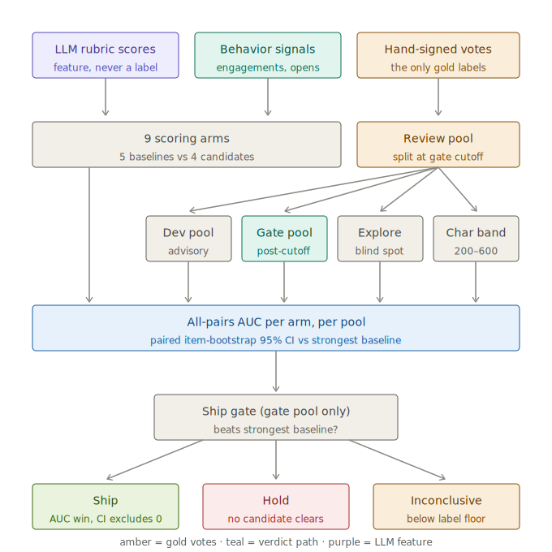
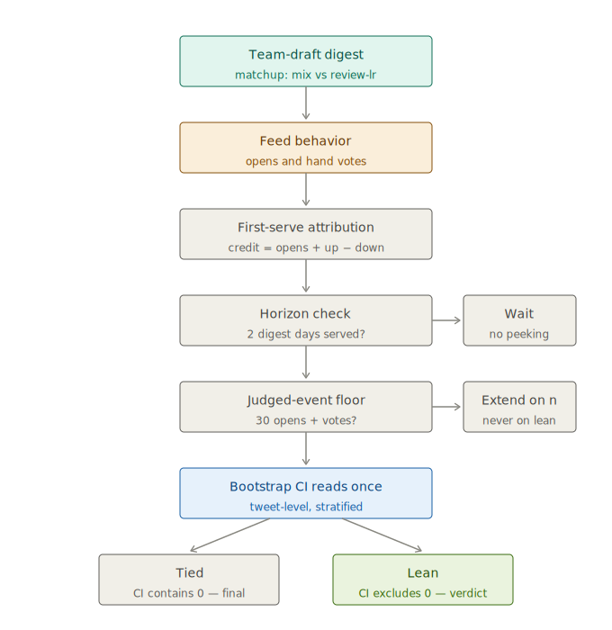

# I rebuilt my X feed for an audience of one

I open X to read three things and close it forty minutes later having read none of them.

The feed isn't ranked for the me that wants to read. It's ranked for the me that can't stop
scrolling. Those are different people, and X sides with the second one.

So I built **actually-for-you** — my feed, re-ranked by my own behavior:

- A Chrome extension quietly watches how I *actually* read: how long I linger, what I open,
  what I save.
- A local pipeline turns that into a taste profile and re-ranks the same tweets.
- Every morning at 8am, it texts me a digest.
- Every digest secretly runs an A/B test between two rankers.
- My thumbs-up / thumbs-down votes decide which ranker survives.

One user. No accounts, no cloud, no API keys. Nothing leaves my laptop.

<picture>
  <source media="(prefers-color-scheme: light)" srcset="reader-light.png">
  
</picture>

The ranking math turned out to be the easy part. The hard parts were **sensing behavior from
a page that fights you** and **building an eval I could trust** — including the day the eval
itself was the bug, and the day my own behavioral data turned out to point backwards. That's
the story.

## Part 1 — a sensor for my own attention

How long you look at a tweet isn't in any API or scrape. X measures it and keeps it. If I
wanted my own attention data, I had to capture it live, from a page that was never meant to be
observed. Each way X fights you became a rule:

- **Match GraphQL by operation name** — the numeric IDs rotate on every deploy.
- **Anchor on `data-testid`, never CSS classes** — the classes are obfuscated and churn weekly.
- **Track dwell by tweet ID, never DOM node** — X recycles nodes as you scroll; track the node
  and you credit one tweet's reading time to whatever renders in its slot next.
- **Watch state, not clicks** — log likes on click events and you miss every keyboard shortcut.

And one architectural rule: content capture and behavior capture run in **separate failure
boundaries**, so a change on X's side can never silently take down both.

The bug that set the project's debugging culture: capture just *stopped* one day. Instead of
staring at code, I added one instrument — *how long since the last write?* — and one log line.
They showed the extension faithfully re-sending the same batch every 15 seconds and the server
throwing it away. The culprit: a malformed **health-check event** — the thing that exists to
make breakage loud — was crashing inside the database transaction and rolling back the real
data with it. My diagnostic was killing the patient. House rule ever since: **don't guess from
code. Add the instrument that makes the invisible state visible, then look.**

## Part 2 — the eval that said "don't ship"

With clean data flowing, I trained a small model and built a gate: beat a dumb baseline on
held-out data or don't ship. The first run said **SHIP ✅**. It was lying three ways: the
"random" baseline scored a perfect 1.0 (tweet IDs encode time, and my positives and negatives
came from different eras — anything touching the ID was secretly sorting by date); the test
pool was 86% positive (ranking by *length* scored 1.0 too); and the keyword baseline had
helped write its own answer key, since I'd curated training labels partly using those
keywords.

After fixing all three, the honest result: **my model lost.** I wrote `HOLD` in the log and
shipped judges instead — a taste score (similarity to ~2,900 tweets I've liked), an LLM
grading each tweet against a written rubric (text only — no author, no like counts, so quality
can't proxy fame), and an author prior from my actual engagement history. Plus a permanent
**explore lane**: 10% of every digest is tweets the ranker did *not* pick, my anti-filter-bubble
valve and a vote-audit set no ranker had a hand in selecting.

The HOLD bought the rules everything now runs on: my hand votes are the **only** ground truth;
keyword and LLM scores may *rank* tweets but never *label* them; length and media are
**confounds**, never features.

## Part 3 — the day the eval became the suspect

Then, week after week, every new ranker came back "statistically tied with keyword." Three
different approaches, all mysteriously equal to a keyword counter? At some point the question
flips: maybe the *ruler* is broken.

It was. The old metric quietly discarded 20% of my votes, only really scored the top of the
pile, and handed the keyword baseline a free pass on every comparison its coarse integer
scores couldn't decide — **a quarter of all comparisons**, concentrated exactly where a taste
ranker earns its keep. I rebuilt the gate around one plain question: **of every pair where I
voted 👍 on one tweet and 👎 on the other, how often does the ranker put my 👍 on top?** Every
vote counts, and a ranker clears only by beating the *strongest* dumb baseline by a margin the
bootstrap says is real. Same votes, honest ruler — the rankers separated immediately.

Mostly. Against the strongest baseline — usually sheer tweet length — my shipped blend still
only *tied*. And there was a subtler problem: I had now changed the metric, the credit
formula, and the baseline policy while staring at ~940 of my own votes. No confidence interval
on those votes accounts for the designer's thumb on the scale. So I froze the design and
declared them a **dev pool** — spent, allowed to advise, never again allowed to verdict. From
that day, only votes the design had never seen could say SHIP.

## Part 4 — the data pointed backwards, and the spent votes bought a winner

Here's the finding that reframed the project. Everything I trained on my *behavioral* labels —
a ranker over harvested likes, probes on dwell and detail-opens — read **~0.44 against my hand
votes, when chance read ~0.49. Below chance.** Not useless — *inverted*. On a surface that's
already ranked for engagement, "what I engaged with" measures the algorithm's pull on me, not
my taste. The models were fine; the labels pointed backwards.

The fix was hiding in the freeze. Those ~940 spent dev votes could never verdict again — which
made them the one non-circular source of *training* labels that actually encode "I want this
in my feed." So: `review-lr`, a logistic regression over a sentence embedding plus the same
three judge signals, trained **only** on pre-freeze votes, judged **only** on post-freeze
votes it has never seen. The train/test boundary is the freeze date itself.

```
▼ prospective gate — pairwise AUC on votes the design has never seen  (128 👍 × 132 👎)
char_len (strongest baseline)  0.724
mix (shipped blend)            0.755   CI includes zero — tied
rubric (LLM judge)             0.772   CI includes zero — tied
review-lr (vote-trained)       0.787   CI excludes zero  →  SHIP ✅
```

The first SHIP the gate has ever printed. And it strengthened as votes accumulated — the CI's
lower bound moved from +0.006 to +0.016 going from n=213 to n=260 — which is what a real
effect does and a lucky artifact doesn't.

## Part 5 — the deciding vote is the product itself

An offline gate can say a ranker isn't worse. It can't say which feed I'd rather live with.
So the final verdict runs live: every morning's digest is secretly drafted by **two rankers
taking turns**, pixel-identical either way — nothing reveals which ranker picked which card,
not even to me.


A ranker earns credit when I open or 👍 its picks and *loses* credit when I 👎 them — junk
should bleed. The first weeks were a pilot (final read: TIED at n=83, which tuned the
instrument, not the rankers). Now the confirmatory match is **mix vs review-lr**, with the
anti-self-deception rules written down before the first serve: the scoreboard prints its
confidence interval **once**, at a predeclared horizon — no peeking, no "run until it's
significant" — and a TIED at that horizon means "no large effect", never "extend and hope."

## The eval, end to end

Parts 2–5 each fixed one piece of the eval. Here's the whole machine they add up to — two
layers: an offline guardrail and an online verdict.

**The offline gate** replays every ranker over my hand votes. Three inputs feed it: my
👍/👎 votes (the only gold labels), behavioral signals, and the LLM rubric scores — the
last two are strictly *features*, never labels, or the eval would grade its own homework.
The votes split at the freeze date into a **dev pool** that may advise and a **prospective
gate pool** that alone can verdict, because no design decision has ever seen it. Nine arms —
five dumb baselines against four candidates — get an all-pairs AUC on every pool (plus two
diagnostic cuts: votes on explore-lane cards no ranker picked, and the 200–600 char band
where length carries no signal). A candidate ships only by beating the *strongest* baseline
with a bootstrap CI that excludes zero; under 40 post-freeze labels the gate refuses to
answer at all.



**The online interleave** is the deciding vote, because an offline gate can only say "not
worse than dumb". Two rankers secretly co-draft each morning's digest; every card's opens
and votes credit — or, for a 👎, debit — the arm that first drafted it. The honesty rails
are the design: the confidence interval is read exactly **once**, at a horizon declared
before the first serve; if there aren't 30 judged events yet, the window extends on sample
size, never on the lean; and a TIED read at the horizon is a final answer, not an
invitation to keep running.



## What I learned

**In behavioral systems, the failure mode is never a crash — it's plausible wrong numbers.**
Every real bug produced data that looked fine: green tests with empty usernames, leaked timers
crediting minutes of attention to tweets I flicked past, a judge quietly grading two-thirds of
the pool. The defenses are boring and work: freshness checks, coverage printed beside every
score, diagnostics that can't take down what they monitor.

**Not shipping is a result.** The eval exists to protect you from your own motivated
reasoning. When it fires, believe it.

**Sometimes the eval is the bug.** The suspicion you aim at a number that looks too good, you
eventually owe to a number that looks too flat. Same move either way: trace, instrument, look.

**The bottleneck was labels, not parameters.** My engagement data — the thing the whole
capture pipeline existed to collect — pointed *away* from my taste, and the model that finally
cleared the gate is a logistic regression. What changed wasn't capacity. It was asking 940
hand votes to do the one job only they could do.

---

_Code and full build log: [github.com/vishkrish200/actually-for-you](https://github.com/vishkrish200/actually-for-you).
Chrome extension (MV3, TypeScript) → zero-dependency Node + SQLite server → pure-TS ranker +
a small Python sidecar for the vote-trained model → local `claude` CLI as the judge → launchd
for the 8am text._

_This project stands on two others. [noscroll](https://noscroll.com) planted the idea that a
feed should answer to its reader, not its host. [backscroll](https://sdan.io/projects/backscroll)
— Surya Dantuluri's personal timeline digest — showed the shape I wanted: pull your own
timeline, grade it with an LLM against a personal rubric, read a ranked digest instead of
scrolling. My LLM judge in Part 2 is a direct descendant of backscroll's `qualityWeight`.
Where this project tries to go further is the part backscroll's writeup names as its open
problem — "the eval setup isn't there" — so the eval became the centerpiece: a behavioral
sensor for the attention data X never exposes, hand votes as the only ground truth, a
prospective gate, and a blinded interleave with the verdict rules written down in advance._
